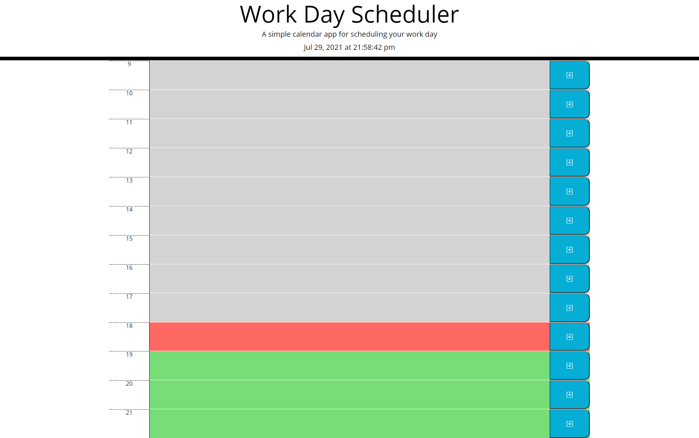

# Daily task list tracker

## Description

This application is intended to be used as a daily event tracker. The time slots are in military times to not confuse.
As the day goes on the line items will change color to signify what part of the day we are at. This is a simple tool.
This has taught me how to use javascript to set intervals for time, navigating the DOM through children and parent elements,
storing the local data, and updating style sheets.

## USAGE

```md

```

## CREDITS

Done with the help of my TA's and some peers from my cohort
